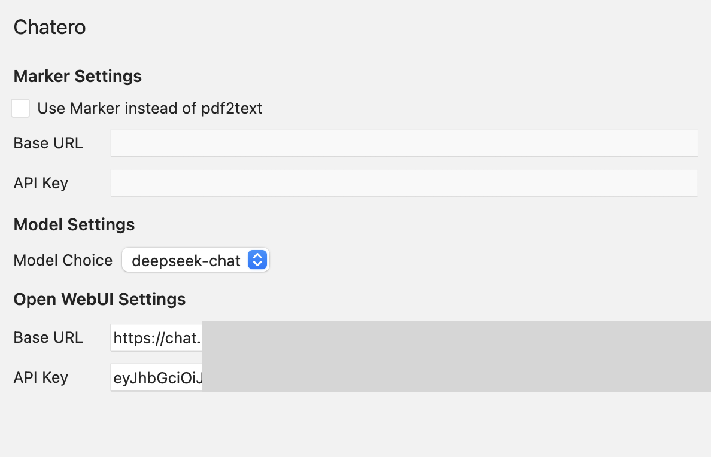
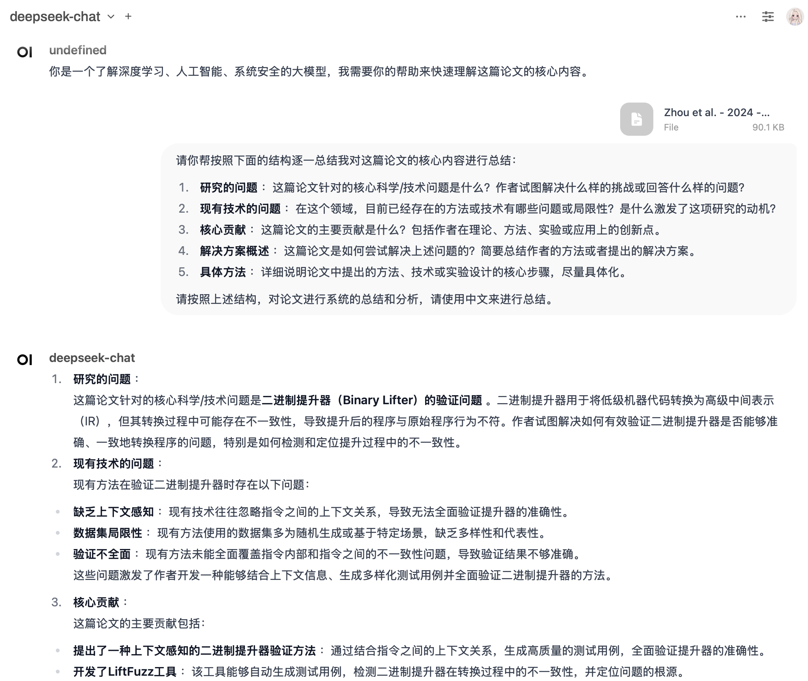

# Chatero

一个在 Zotero 里面总结论文的插件，与 Open WebUI 进行整合。在设置中添加 Open WebUI 的账号与 API Key （可以通过抓包拿到） 之后，可以执行这几件事情

- 获取 Open WebUI 上的模型，作为模型的列表
- 上传论文的文本到 Open WebUI，以附件的形式对 Open WebUI 的模型进行请求
- 将结果总结结果上传到 Open WebUI，以实现后续的对话。

现在还不支持用 Marker，而是用 Zotero 自己的提取文本的接口获取论文的内容，也没有自动化地去掉参考文献的部分。

# Credit

基于 [zotero-plugin-template](https://github.com/windingwind/zotero-plugin-template) 进行开发。如何使用请参考模版里面的文档。
