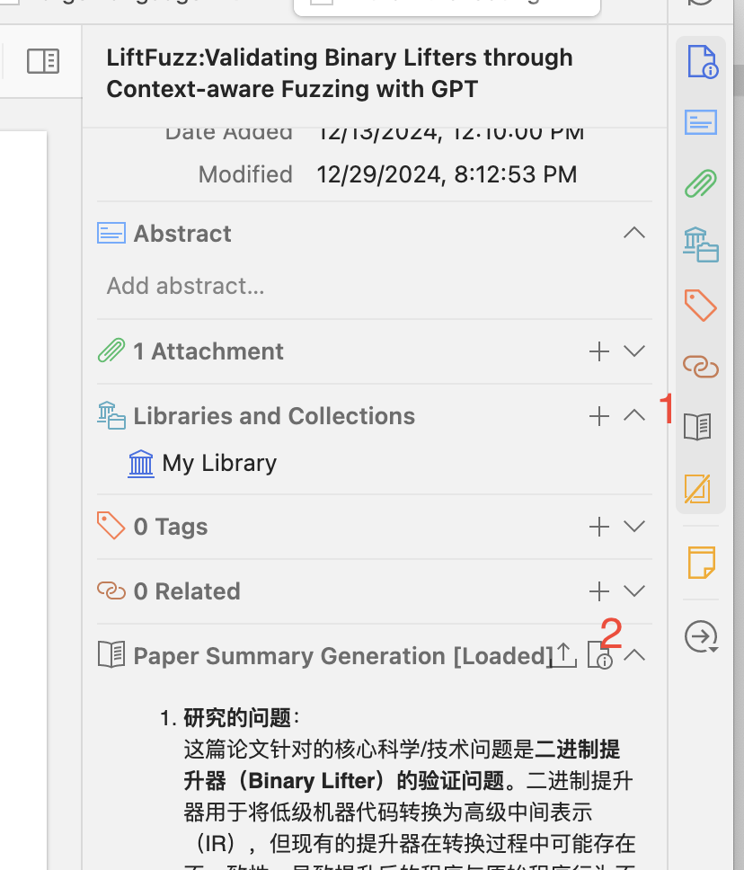

# Chatero

## Introduction

一个在 Zotero 里面总结论文的插件，与 Open WebUI 进行整合。在设置中添加 Open WebUI 的账号与 API Key （可以通过抓包拿到） 之后，可以执行这几件事情

- 获取 Open WebUI 上的模型，作为模型的列表
- 上传论文的文本到 Open WebUI，以附件的形式对 Open WebUI 的模型进行请求，在侧边栏进行展示。

    

- 将结果总结结果上传到 Open WebUI，以实现后续的对话。

    

- 把总结结果保存到 Zotero 的 Note 里面。

    

## Discussion

Prompt 是随便让 GPT 生成的一个 Prompt，感觉结果也还可以就直接用了。如果有更好的 Prompt 可以替换。

为什么不用 [Aria](https://github.com/lifan0127/ai-research-assistant) 或者 [zotero-gpt](https://github.com/MuiseDestiny/zotero-gpt)：因为太复杂了，用不明白，之前 zotero-gpt 没有成功跑起来，所以就自己写了一个。

与 papers.cool 的区别：papers.cool 只有 Arxiv 的论文，而且也不能改 Prompt。

现在还不支持用 Marker 去提取文本，而是用 Zotero 自己的提取文本的接口获取论文的内容，也没有自动化地去掉参考文献的部分。

# Credit & Usage

基于 [zotero-plugin-template](https://github.com/windingwind/zotero-plugin-template) 进行开发。如何使用请参考模版里面的文档。
